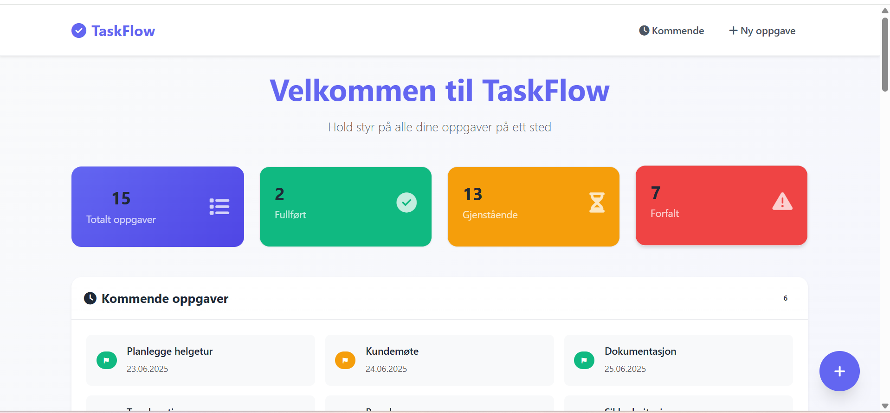
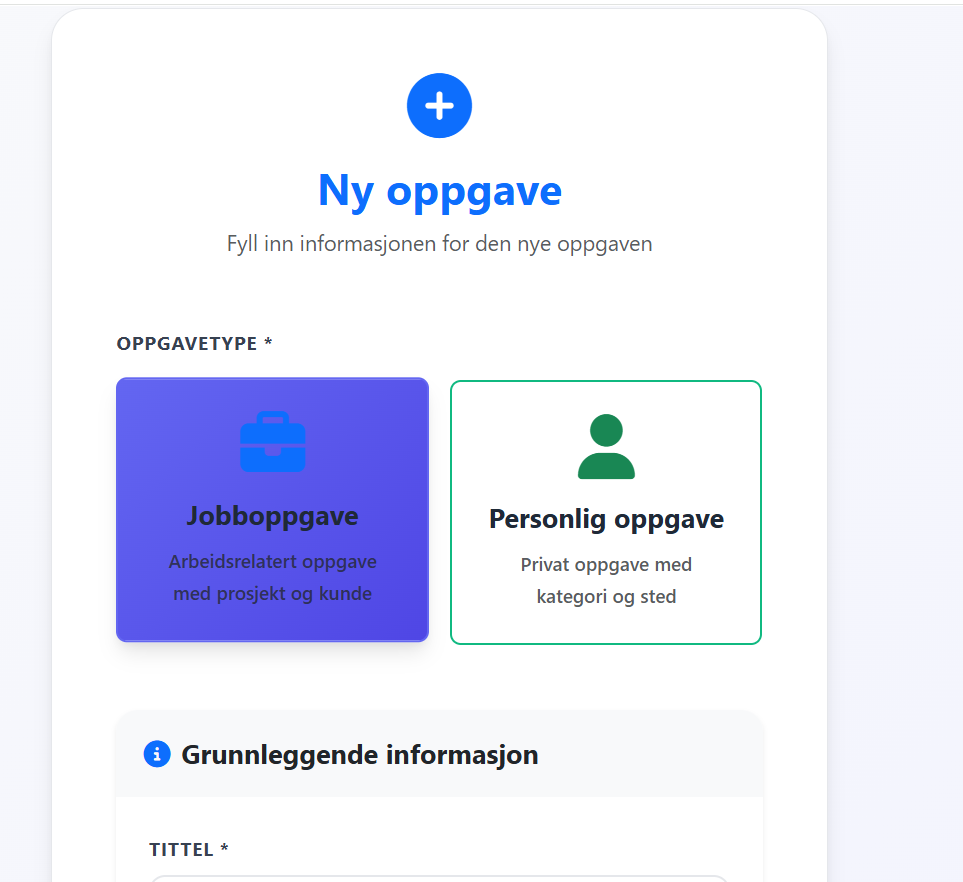
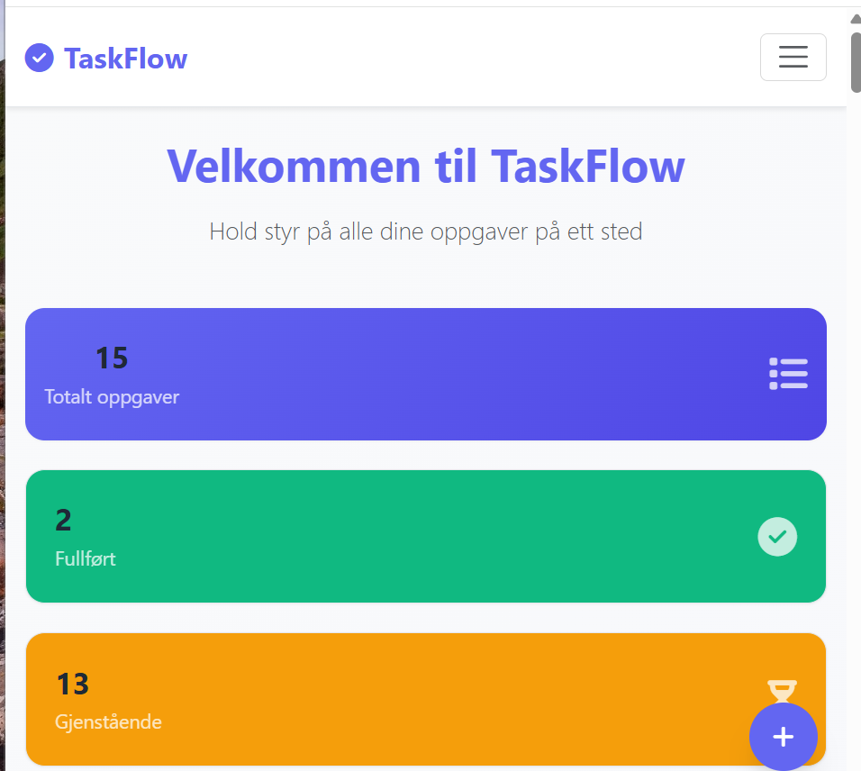

# TaskFlow - Oppgavebehandlingssystem

Et moderne og brukervennlig oppgavebehandlingssystem bygget med Spring Boot. TaskFlow lar deg organisere både jobb- og personlige oppgaver med prioritering, kategorisering og avansert filtrering.


##  Teknologier

### Backend
- **Spring Boot 3.5** - Hovedrammeverkframework
- **Spring Data JPA** - Database abstraksjon
- **Spring Web MVC** - Web layer
- **H2 Database** - Embedded database for utvikling
- **Bean Validation** - Input validering

### Frontend
- **Thymeleaf** - Server-side templating
- **Bootstrap 5.3** - CSS framework
- **Font Awesome 6.4** - Ikoner
- **Custom CSS/JavaScript** - Tilpasset styling og interaktivitet

### Testing
- **JUnit 5** - Unit testing framework
- **Mockito** - Mocking framework
- **Spring Boot Test** - Integration testing
- **TestContainers** - Database testing

##  Funksjoner

###  Jobboppgaver
- Opprett oppgaver knyttet til prosjekter
- Spor kunde og avdeling
- Prioritering (Høy, Medium, Lav)
- Forfallsdatoer og status

###  Personlige oppgaver
- Kategoriser etter type (Helse, Shopping, Familie, etc.)
- Stedsinformasjon
- Samme prioriteringssystem

###  Avansert filtrering
- Filtrer etter status (Aktive, Fullførte, Forfalte)
- Prioritetsfiltrering
- Kommende oppgaver (neste 7 dager)


###  Dashboard
- Statistikk oversikt
- Oppgavetellere
- Kommende oppgaver preview
- Visuell prioritetsindikering

###  Responsiv design
- Fungerer på desktop, tablet og mobil
- Animasjoner og hover-effekter
- Moderne flat design


### Forutsetninger
- Java 17 eller høyere
- Maven (innebygd via wrapper)

### Kjør applikasjonen

#### Metode 1: IDE (IntelliJ IDEA / Eclipse)
1. Åpne prosjektet i din IDE
2. Naviger til `src/main/java/com/taskmanager/TaskManagementWebApplication.java`
3. Høyreklikk på filen og velg **"Run"** eller **"Run As → Java Application"**
4. Vent til du ser meldingen: " Oppgavebehandlingssystem startet!"

#### Metode 2: Kommandolinje (hvis mvnw fungerer)
```bash
# Windows
mvnw.cmd spring-boot:run

# macOS/Linux
./mvnw spring-boot:run
```

### Åpne applikasjonen
 **Navigér til:** http://localhost:8080

Du vil se velkomstskjermen med sample data ferdig lastet!

##  Screenshots

### Hovedside - Dashboard


Oversikt over alle oppgaver med statistikk og filtrering.

### Opprett oppgave

Intuitivt skjema for å opprette jobb- eller personlige oppgaver.

### Responsiv design

Fungerer perfekt på alle enheter.

## 🗄️ Database

### H2 Console (Utviklingsmodus)
- **URL:** http://localhost:8080/h2-console
- **JDBC URL:** `jdbc:h2:file:./data/taskflow`
- **Brukernavn:** `sa`
- **Passord:** (tom)

### Sample data
Applikasjonen laster automatisk inn eksempeldata ved første oppstart:
- 5 jobboppgaver (ulike prosjekter og kunder)
- 5 personlige oppgaver (forskjellige kategorier)
- Blanding av aktive, fullførte og forfalte oppgaver

## 🏗️ Arkitektur

### Mappestruktur
```
src/main/java/com/taskmanager/
├── controller/          # Web controllers (MVC)
├── model/              # Domain entities
│   ├── Task.java       # Abstract base class
│   ├── WorkTask.java   # Jobboppgaver
│   ├── PersonalTask.java # Personlige oppgaver
│   └── TaskManager.java # Business logic
├── repository/         # Data access layer
├── service/           # Service layer
└── config/            # Konfigurasjon og data loading

src/main/resources/
├── templates/         # Thymeleaf templates
├── static/           # CSS, JS, bilder
└── application.properties # App konfigurasjon
```

### Design patterns
- **MVC Pattern** - Controller, Service, Repository separation
- **Single Table Inheritance** - Task polymorfisme
- **Dependency Injection** - Spring IoC container
- **Template Method** - Thymeleaf templating

## 🧪 Testing

### Kjør tester
```bash
# Alle tester
mvnw test

# Spesifikk test klasse
mvnw test -Dtest=TaskControllerTest
```

### Test dekning
- **Unit tests** - Service og business logic
- **Integration tests** - Repository og database
- **Web layer tests** - Controller endpoints
- **~95% kodedekning** på core komponenter


### Tekniske høydepunkter
- **Type-safe** entities med JPA annotations
- **Transactional** data operations
- **Responsive** web design
- **Comprehensive** test suite
- **Production-ready** structure

---

**🎯 Kjør `TaskManagementWebApplication.java` og utforsk på http://localhost:8080**